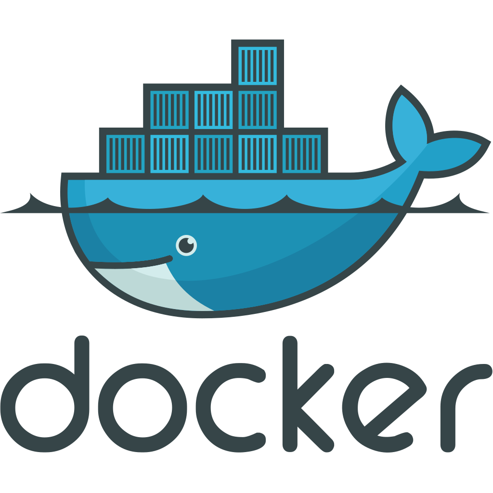
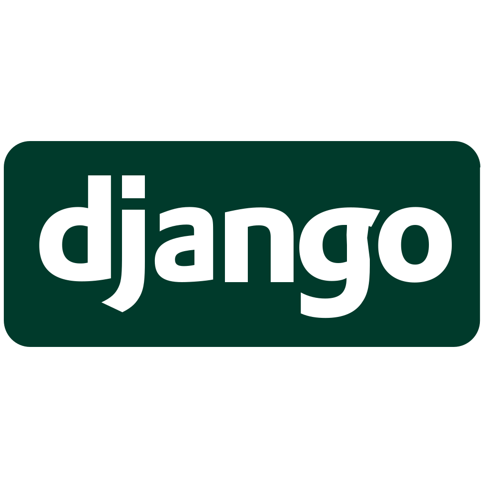
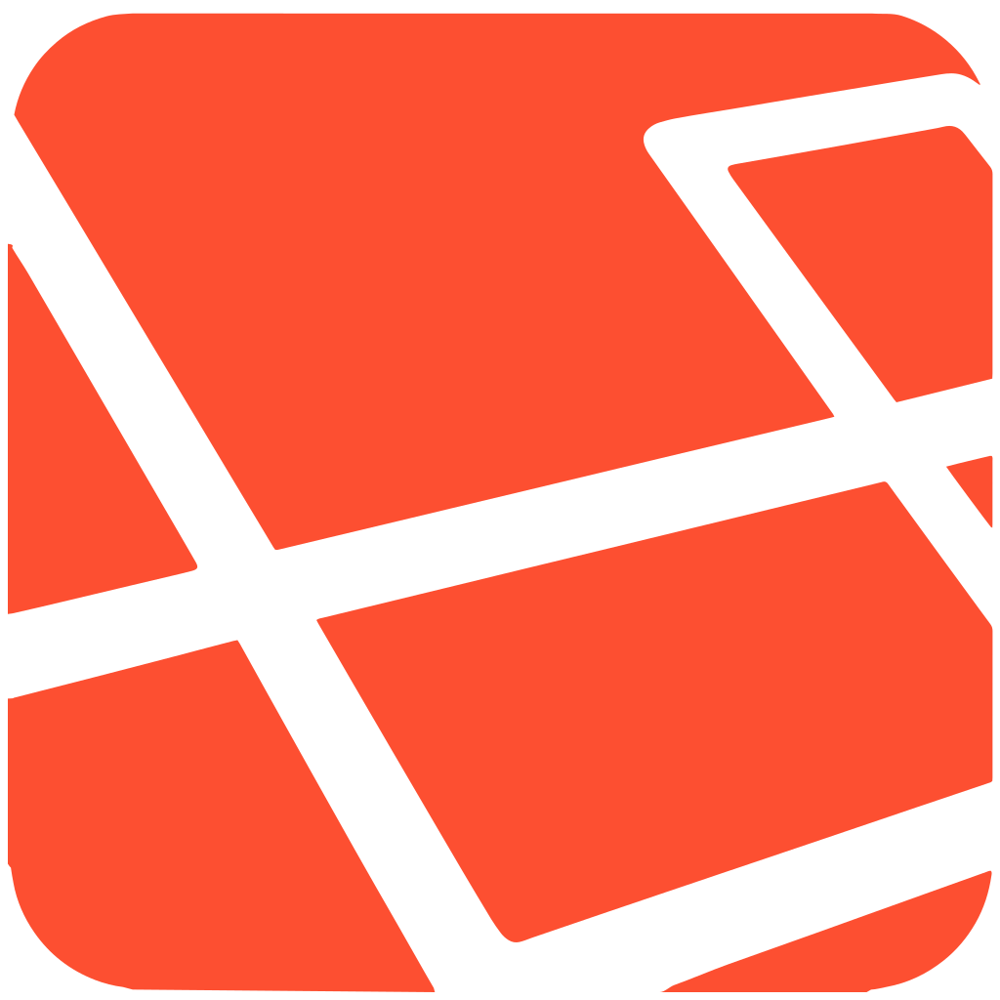
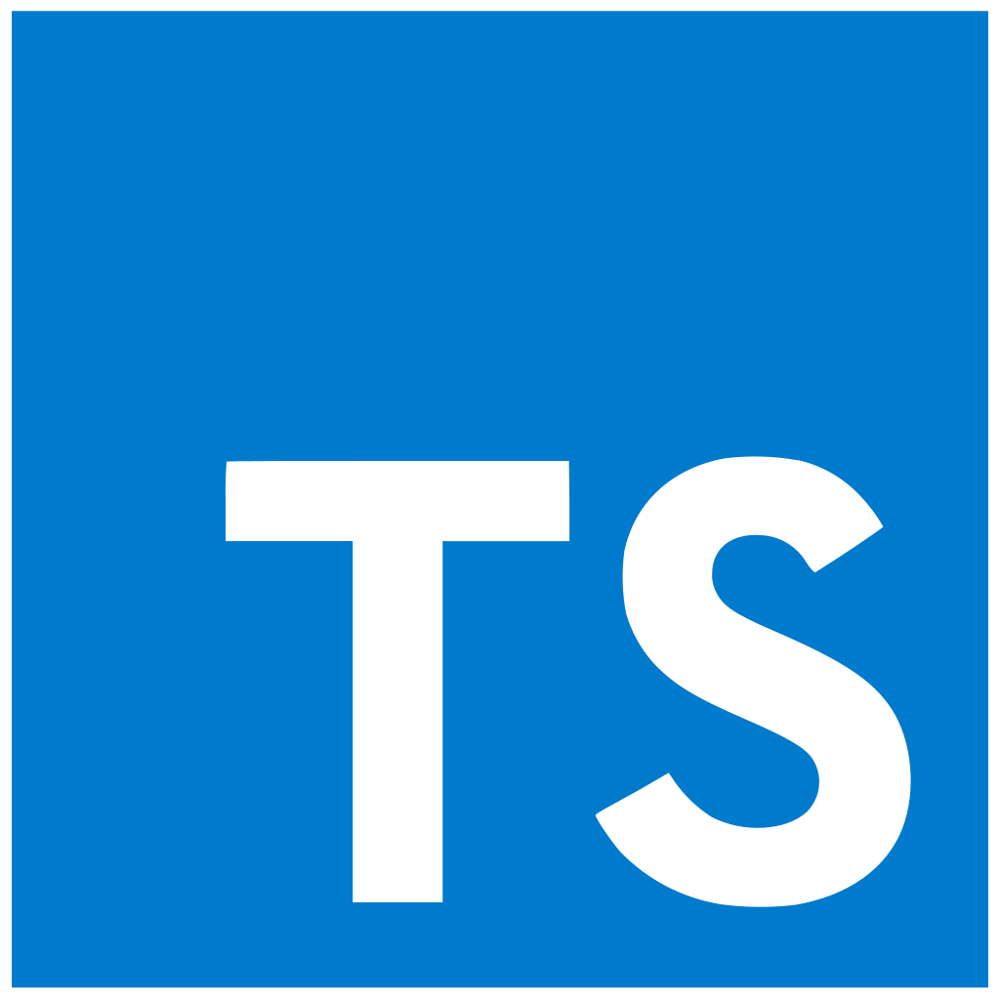
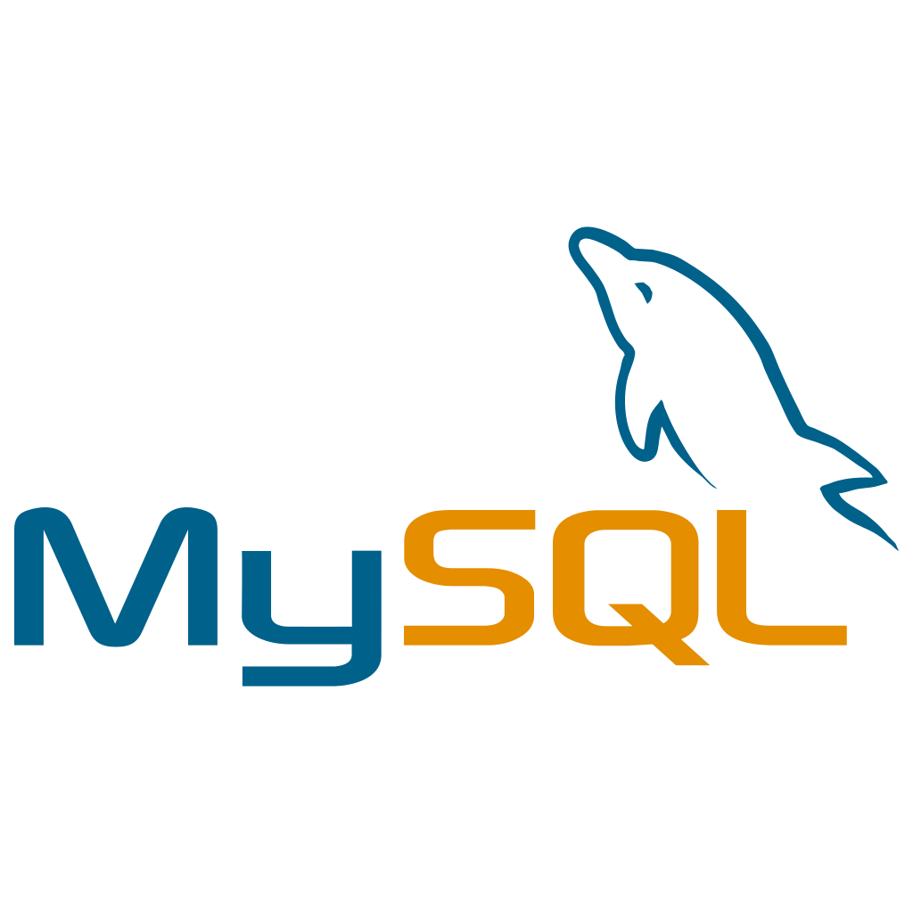

### Howdy! I'm Felipe - aka Bokkoa 🤠

## I'm a Software Engineer  

- 🦈 Currently working as techlead developer
- 😸 Also working in personal projects
- ☕️ Coffee types and herbalism are other of my interests!

- I love this playlist ->
[][spotifyplaylist]

### You can find me here:

[][website]

[][linkedin]

[][gitlab]

 
 

## Favorite languages & tools

 
 
 
 

[website]:https://bokkoa.github.io/FCReloaded/
[linkedin]:https://www.linkedin.com/in/bokkoa/
[gitlab]:https://gitlab.com/Bokkoa
[spotifyplaylist]:https://open.spotify.com/playlist/1Hf9QiYoODGHXZupYyzEQt?si=2a3626494bfb40f9
